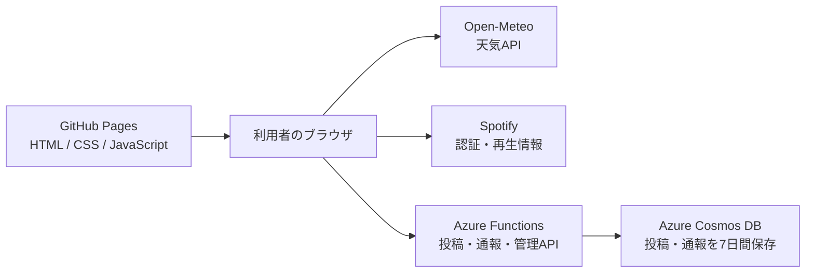

# WeatherSpot

WeatherSpotは、都市の天気、窓から見えるドット絵の景色、Spotifyで再生中の曲を組み合わせたWebアプリです。名前、都市、天気、30文字以内のひとことを公開タイムラインへ共有でき、曲を聴いている場合は曲情報も追加できます。Spotifyを利用していない場合でも投稿できます。

**公開サイト:** [https://sora1189.github.io/weatherspot/](https://sora1189.github.io/weatherspot/)


## コンセプト

天気を数値で確認するだけでなく、その場所の空気感と、そのとき聴いている音楽や気分を一緒に残せるサービスを目指しました。

- **WEATHER:** 5都市の現在天気と時間別予報
- **SPOTIFY:** 再生中の曲の取得、自動更新、再生操作
- **DIARY:** 天気・都市・曲・ひとことを共有するクラウド天気日記

## 主な機能

- Open-Meteoによる現在の天気と時間別予報
- 東京、ロンドン、ニューヨーク、北京、テキサスの5地域に対応
- 都市・天気・現地時刻に連動するドット絵の窓景色
- 通常表示と窓枠モード
- SpotifyのPKCE認証
- 再生中の曲を約5秒間隔で確認し、曲の切り替わりを画面へ反映
- Spotifyの再生・停止・曲送りなどの操作
- 曲あり・曲なしの両方に対応した投稿
- Azure FunctionsとCosmos DBを使った公開タイムライン
- 最新投稿を最大30件表示
- 投稿と通報を7日後に自動削除
- 同じブラウザ識別子からの投稿を10分間に5件までに制限
- 投稿の通報、管理者による確認・削除・問題なし処理
- PC・タブレット・スマートフォン向けレスポンシブ表示

## 使い方

1. 都市を選び、`RUN WEATHER CHECK`を押します。
2. 現在天気、時間別予報、窓の景色を確認します。
3. 必要に応じてSpotifyへログインし、再生中の曲を取得します。
4. `MENU`から共有画面を開き、名前と30文字以内のひとことを入力します。
5. 内容を確認して投稿すると、`LIVE FEED`へ表示されます。

曲情報は任意です。Spotifyへログインしていない場合や、曲を再生していない場合も投稿できます。

## システム構成



画面はGitHub Pagesから静的配信し、共有データの検証と保存はAzure側へ分離しています。Cosmos DBの接続キーや管理者キーはブラウザへ含めません。

## 使用技術

### フロントエンド

- HTML / CSS / JavaScript
- GitHub Pages
- [Open-Meteo API](https://open-meteo.com/)
- [Spotify Web API](https://developer.spotify.com/documentation/web-api)
- Spotify Web Playback SDK

### バックエンド

- Azure Functions Flex Consumption / Node.js 22
- Azure Cosmos DB for NoSQL
- Cosmos DB TTLによる7日間のデータ保持

## ファイル構成

```text
.
├─ index.html
├─ app.js
├─ assets/
│  ├─ large-window/       # 都市ごとの昼・夜背景
│  └─ scenes/             # 小窓用のドット絵レイヤー
├─ scripts/
│  ├─ storage.js          # 設定とブラウザ内データ
│  ├─ api.js              # Azure Functionsとの通信
│  ├─ weather.js          # 天気の取得、分類、画面反映
│  ├─ spotify.js          # Spotify認証、曲取得、再生操作
│  └─ ui.js               # メニュー、投稿、管理画面、起動演出
├─ styles/
│  ├─ boot.css            # 起動演出
│  ├─ dashboard.css       # ダッシュボード
│  ├─ window.css          # 窓と天候アニメーション
│  ├─ menu.css            # メニューと投稿画面
│  └─ responsive.css      # レスポンシブ対応
├─ api/
│  ├─ src/functions/      # 投稿・通報・管理API
│  ├─ src/lib/            # 検証、認証、Cosmos DB接続
│  └─ test/               # APIのテスト
├─ deploy-azure-flex.ps1  # Azureへの配置
├─ cleanup-old-azure.ps1  # 不要な旧Azureリソースの確認・削除
├─ AZURE_DEPLOY.md
└─ SECURITY.md
```

## ローカルで確認する

ファイルを直接開くのではなく、ローカルWebサーバーから表示します。例えば、プロジェクトフォルダーで次を実行します。

```powershell
py -m http.server 5510
```

その後、ブラウザで次を開きます。

```text
http://127.0.0.1:5510/index.html
```

VS CodeのLive Serverを利用する場合も、Spotify Developer Dashboardに登録したRedirect URIと完全に同じURL・ポート番号を使用してください。

## Spotify認証

Spotifyログインには、ブラウザアプリ向けのAuthorization Code with PKCEを使用しています。

- パスワードはSpotify公式ページへ入力し、WeatherSpotでは取得しません。
- Client Secretはブラウザへ置きません。
- 許可された範囲で、再生中の曲、再生状態、再生操作を利用します。
- アクセストークンと更新トークンは利用者のブラウザ内に保存されます。

Spotify Developer DashboardのRedirect URIには、実際に使用するローカルURLとGitHub Pages URLを登録してください。

## AzureへAPIを配置する

Azure CLIへログインし、PowerShellでプロジェクトフォルダーを開いて実行します。

```powershell
az login
powershell -ExecutionPolicy Bypass -File .\deploy-azure-flex.ps1
```

このスクリプトは既存のFlex Consumption環境を再利用し、Cosmos DB接続、CORS、HTTPS、管理者キー、APIコードを更新します。正常終了後、公開APIのURLと管理者キーファイルの場所が表示されます。

詳細は[Azure配置手順](AZURE_DEPLOY.md)を参照してください。

## API

| メソッド | パス | 用途 |
|---|---|---|
| `GET` | `/api/posts` | 最新投稿の取得 |
| `POST` | `/api/posts` | 投稿の作成 |
| `POST` | `/api/reports` | 投稿の通報 |
| `GET` | `/api/moderation/reports` | 管理者による通報一覧取得 |
| `DELETE` | `/api/moderation/posts/{postId}` | 管理者による投稿削除 |
| `DELETE` | `/api/moderation/reports/{postId}` | 管理者による通報の問題なし処理 |


詳しくは[セキュリティ上の注意](SECURITY.md)を参照してください。
