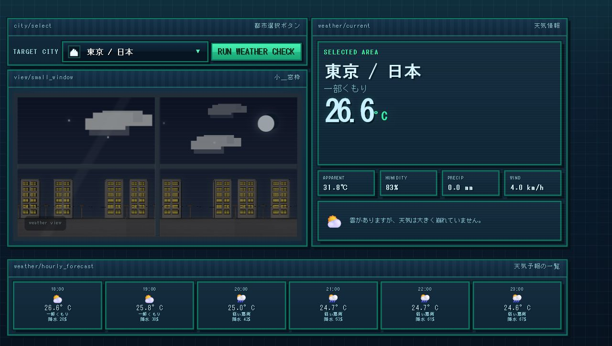

# WeatherSpot Terminal

WeatherSpotは、都市の天気・窓の景色・Spotifyで再生中の曲を組み合わせた天気ダッシュボードです。現在の曲、天気、都市、名前、30文字までのひとことを公開タイムラインへ共有できます。



## 主な機能

- Open-Meteoによる現在の天気と時間別予報
- 天気・時間帯・都市に連動する窓の景色
- 通常表示と窓枠モード
- Spotifyログイン、再生中の曲の自動更新、再生操作
- Azure FunctionsとCosmos DBを使った公開タイムライン
- 投稿と通報の7日間自動保存
- 投稿の通報、管理者による確認・削除・問題なし処理
- PC・タブレット・スマートフォン向けレスポンシブ表示

## 使用技術

- HTML / CSS / JavaScript
- [Open-Meteo API](https://open-meteo.com/)
- [Spotify Web API](https://developer.spotify.com/documentation/web-api)
- Spotify Web Playback SDK
- Azure Functions Flex Consumption
- Azure Cosmos DB for NoSQL
- GitHub Pages

## ファイル構成

```text
.
├─ index.html
├─ assets/
├─ scripts/
│  ├─ storage.js   # ブラウザ内の設定保存
│  ├─ api.js       # Azure Functionsとの通信
│  ├─ weather.js   # 天気の取得と表示
│  ├─ spotify.js   # Spotify認証と再生
│  └─ ui.js        # 画面操作と起動演出
├─ styles/
│  ├─ boot.css
│  ├─ dashboard.css
│  ├─ window.css
│  ├─ menu.css
│  └─ responsive.css
├─ api/            # Azure Functions
├─ deploy-azure-flex.ps1
└─ cleanup-old-azure.ps1
```

## ローカルで確認する

このプロジェクトのフォルダーでローカルサーバーを起動し、次のURLを開きます。

```text
http://127.0.0.1:5510/index.html
```

Spotify Developer Dashboardには、実際に使用するローカルURLとGitHub Pages URLをRedirect URIとして登録してください。

## AzureへAPIを配置する

```powershell
powershell -ExecutionPolicy Bypass -File .\deploy-azure-flex.ps1
```

この処理は既存のFlex Consumption環境を再利用し、Cosmos DB接続、CORS、HTTPS、管理者キー、APIコードを更新します。詳細は [AZURE_DEPLOY.md](AZURE_DEPLOY.md) を参照してください。

## GitHub Pagesで公開する

1. 秘密情報が除外されていることを確認します。
2. 変更をGitHubへpushします。
3. GitHubリポジトリの `Settings → Pages` を開きます。
4. `Deploy from a branch`、ブランチ `main`、フォルダー `/(root)` を選びます。
5. 公開されたURLをSpotifyのRedirect URIへ追加します。

管理者キー、Cosmos DBキー、Spotify Client Secretは公開しないでください。詳しくは [SECURITY.md](SECURITY.md) を参照してください。
